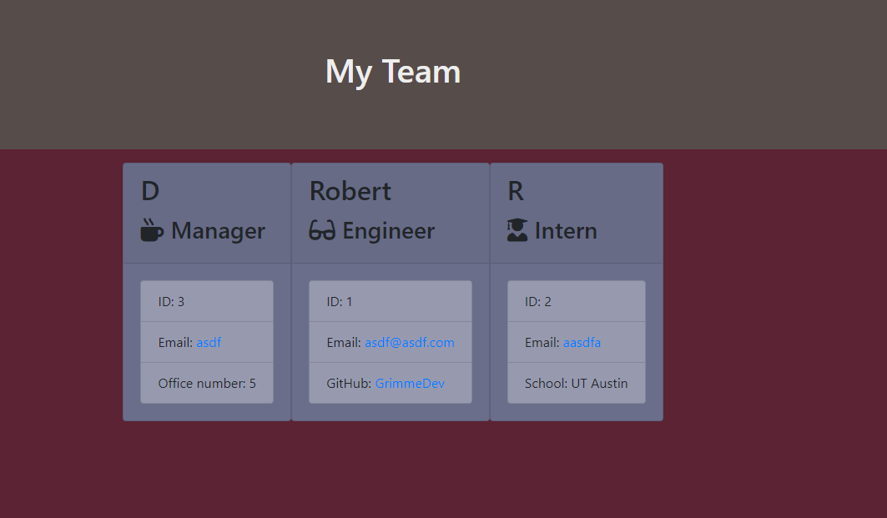

# Employee Summary
## Description
This is an Inquirer powered HTML generator that takes in input from the user and will output a rendered HTML file containing a summary of the employees entered by the user
## Table of Contents
* [Description](#Description)
* [Installation](#Installation)
* [Usage](#Usage)
* [License](#License)
* [Example Images](#Examples)

* [Questions](#Questions)

## Installation
Once you clone down the repo, run `npm install` at the root where index.js is located
## Usage
VIDEO INSTRUCTIONS <a href="https://drive.google.com/file/d/1b_HE9wBiZqGrHXxv8TTiBiy1c1sxxfXI/view">Click here for the video</a> 
After the necessary files have been installed from above, run `node index.js`. You will then be presented with a looping series of questions to answer that allows you to enter employee information (name, ID, email) and with each you will be asked to state the role of the employee (Manager, Engineer, Intern). With each role one question will be asked. Enter as many employees as you want and when you are finished simply hit `N` when it asks if you would like to enter an employee
### License
MIT
### Collaborators

### Examples

#### Questions?
If you have questions regarding this program: 
Send me a message through GitHub:  
Or through email here: 
